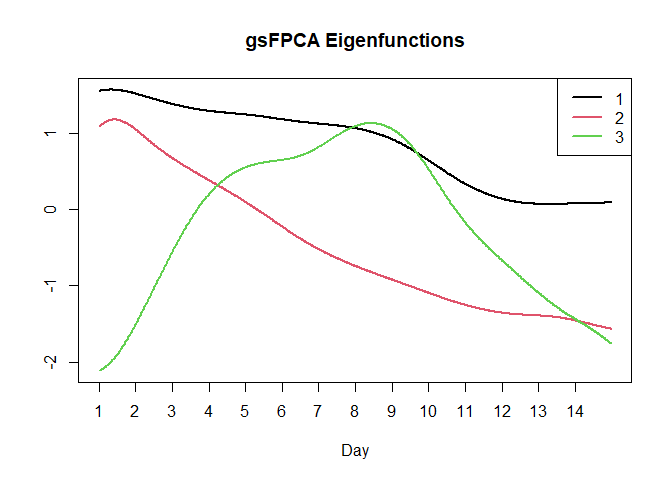

<!-- README.md is generated from README.Rmd. Please edit that file -->

# gFPCAClassif

<!-- badges: start -->
<!-- badges: end -->

The goal of gFPCAClassif is to model and train classifiers for
binary-valued functional data. The package presents model-based
classification methods for the binary-valued functional data. The
package accounts for multiple different scenarios of the data. All of
these models are built under the assumption that the binary data are
binary-valued observations of smooth latent functions.

## Installation

You can install the development version of gFPCAClassif like so: This
package is currently available on GitHub at
{<https://github.com/acweisha/gFPCAClassif>}

## Example

This is a basic example which shows you how to solve a common problem:

To model the binary data, we fit the model without covariates, the
number of eigenfucntions are determined by a PVE of 0.95,

``` r
 gsFPCA.model = gsFPCA(X_dat_s = X_dat_train,
                Ys = acc_data_train$group, covariates = NA,
                pve = 0.95, Kb = 10, bs0="cr")
```

The smooth trajectories are estimated using the 10 cubic regression
splines. The resulting object, , contains the estimated mean function,
eigenfunctions, and the account’s corresponding principal component
scores. The estimated principal components scores for each account can
be easily viewed in the output by:

``` r
head(gsFPCA.model$scores_train)
#>             psi1        psi2        psi3
#> [1,]  0.46425138 -0.23886527 -0.12459635
#> [2,]  0.68930728 -0.12412110 -0.19138972
#> [3,] -0.57787830 -0.26004744  0.03867028
#> [4,]  0.73441177 -0.21517720 -0.16258036
#> [5,] -0.01012554 -0.06334019 -0.08914326
#> [6,]  0.34669469 -0.18249006  0.05152066
```

By providing the eigenfuntions and scores, researchers are able to
interpret the values of the principal component scores and better
understand the accounts’ posting patterns. The eigenfunctions are
visualized by using the function:

``` r
matplot(gsFPCA.model$eigen_funcs, type="l", lwd = 2, 
        lty = 1, xlab = "Day", 
        main = "gsFPCA Eigenfunctions", xaxt="n")
axis(1, at = (0:13)*48+1, labels = 1:14)
legend("topright", 
       legend = 1:length(colnames(gsFPCA.model$scores_train)),
       col = 1:length(colnames(gsFPCA.model$scores_train)), 
       lty=1, lwd=2)
```



The eigenfunctions explain the variability in posting patterns. For
example the first eigenfunction has a slight decline over the two weeks
and is positive throughout the study duration. This eigenfunction
indicates that the overall frequency of posts is a main source of
variability among accounts’ posting patterns. The second eigenfunction
addresses differences in the posting behavior between the first week
versus the second week. Finally, the third eigenfunction addresses
differences of the posting habits during the middle of the study from
the posting habits at the beginning and end of the study.

To predict the groups of new individuals we use the function and input
the trained with the posting data from the new accounts,

``` r
gsFPCA.results = gsFPCA_predict(gsFPCA.model,
                        X_dat_s_new = X_dat_test)
```

The function predicts the groups of new accounts based on their binary
functional data. Comparing the results to true values show us that the
accurately discriminate 88% of the users.

``` r
 table(gsFPCA.results, acc_data_test$group)
#>               
#> gsFPCA.results  1  2
#>              1 45  6
#>              2  5 44
```

The previous analysis trained and tested the classifier using only the
binary-valued functional data. We can include the number of followers
for each account as an additional covariate in the nonparametric Bayes
classifier. The updated model was fitted considering the number of
followers and binary functional data is fit and evaluated by:

``` r
gsFPCA.model.ff = gsFPCA(X_dat_s = X_dat_train,
                      Ys = acc_data_train$group, 
                      covariates = cbind.data.frame(followers =
                      acc_data_train$followers_count),
                      pve = 0.95, Kb = 10, bs0="cr")
gsFPCA.results = gsFPCA_predict(gsFPCA.model.ff,
                      X_dat_s_new =  X_dat_test,
                      covariates_new=cbind.data.frame(followers=
                      acc_data_test$followers_count))
table(gsFPCA.results, acc_data_test$group)
#>               
#> gsFPCA.results  1  2
#>              1 46 18
#>              2  4 32
```

Adding the number of followers for each account actually decreased the
performance of the classifier as the updated classifier accurately
labeled 82% of the new accounts. Similar results are observed when
including the number of friends into the models.
